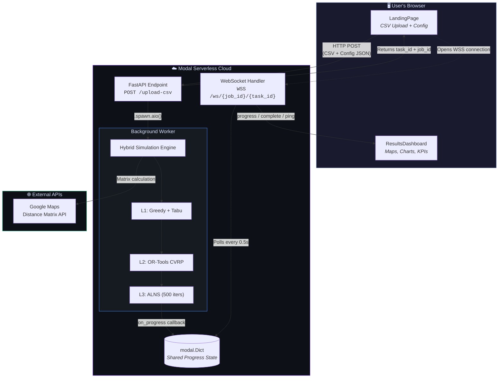
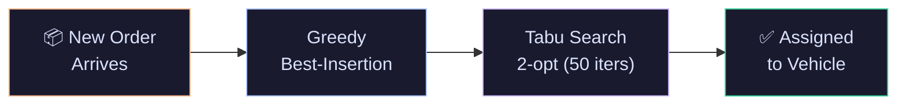
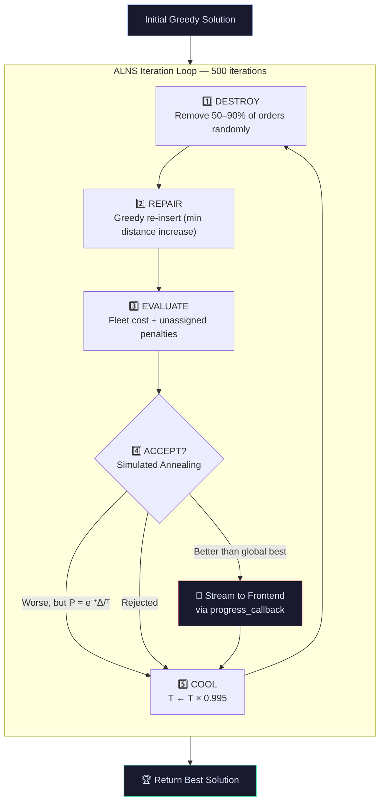
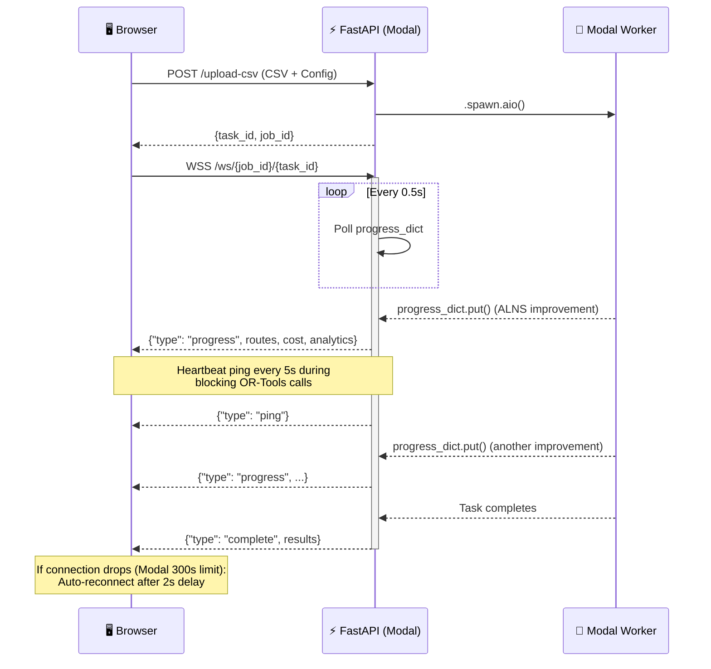
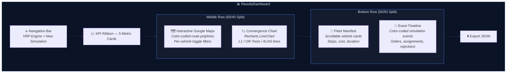
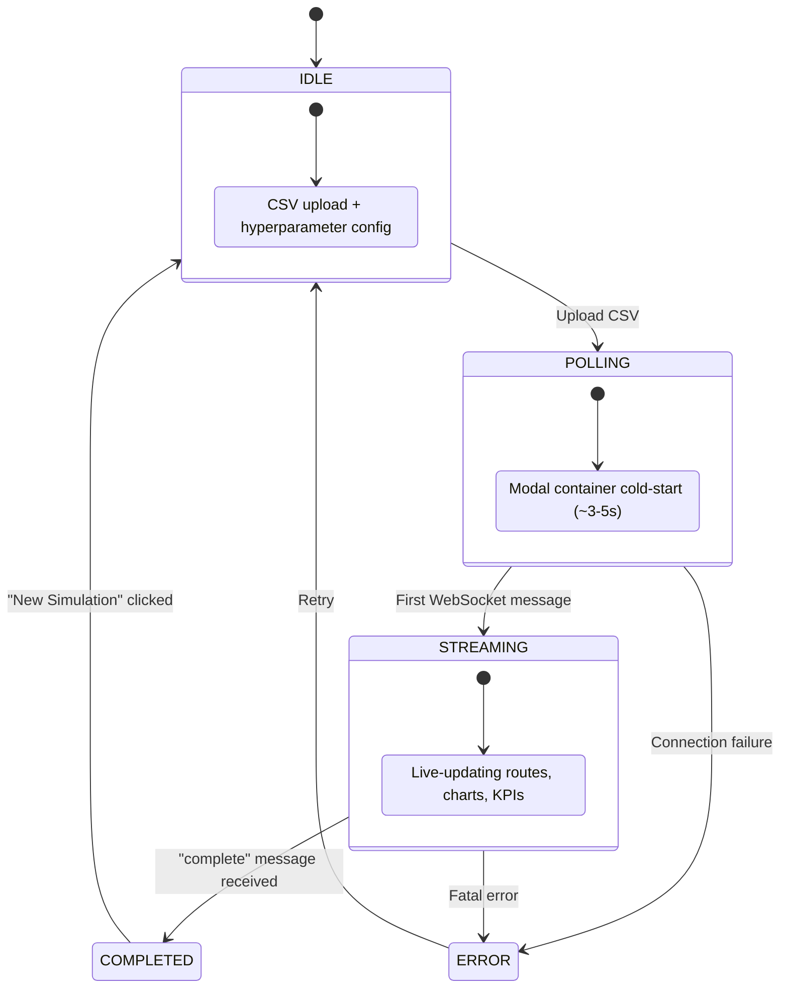
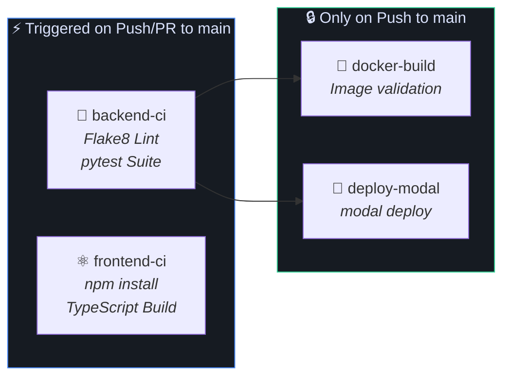

<p align="center">
  
  
  
  
  
  
</p>

<h1 align="center">🚚 Real-Time Vehicle Routing Engine</h1>

<p align="center">
  <em>
    A production-grade, serverless delivery routing system that solves the Capacitated Vehicle Routing Problem (CVRP)<br/>
    using a three-layer hybrid optimization architecture — Google OR-Tools, ALNS, and greedy heuristics —<br/>
    with live WebSocket-streamed convergence visualization.
  </em>
</p>

<p align="center">
  <a href="https://vrp-engine.vercel.app"><strong>🌐 Live Demo</strong></a> &nbsp;·&nbsp;
  <a href="#architecture"><strong>🏗️ Architecture</strong></a> &nbsp;·&nbsp;
  <a href="#the-three-layer-solver"><strong>🧠 Solvers</strong></a> &nbsp;·&nbsp;
  <a href="#getting-started"><strong>🚀 Getting Started</strong></a>
</p>

<br/>

---

## Table of Contents

- [Why This Exists](#why-this-exists)
- [Architecture](#architecture)
- [The Three-Layer Solver](#the-three-layer-solver)
  - [Layer 1 — Greedy + Tabu Search (Real-Time)](#layer-1--greedy--tabu-search-real-time)
  - [Layer 2 — Google OR-Tools (Batch Optimization)](#layer-2--google-or-tools-batch-optimization)
  - [Layer 3 — ALNS Metaheuristic](#layer-3--alns-metaheuristic)
  - [Strategy Modes](#strategy-modes)
- [WebSocket Streaming Architecture](#websocket-streaming-architecture)
- [Frontend Dashboard](#frontend-dashboard)
- [Cost Model](#cost-model)
- [CI/CD Pipeline](#cicd-pipeline)
- [Project Structure](#project-structure)
- [Getting Started](#getting-started)
- [Configuration Reference](#configuration-reference)
- [Tech Stack](#tech-stack)

---

## Why This Exists

The Vehicle Routing Problem (VRP) is **NP-Hard** — there is no known polynomial-time algorithm that produces an optimal solution as the number of delivery stops grows. Real-world logistics companies face a brutal tradeoff: spend hours computing mathematically optimal routes, or accept a "good enough" greedy solution and leave money on the table.

This engine eliminates that tradeoff by running **three optimization layers simultaneously**, each operating at a different time horizon:

| Layer | Algorithm | Latency | Purpose |
|:------|:----------|:--------|:--------|
| **L1** | Greedy Best-Insertion + Tabu Search | < 50ms | Instant order assignment as deliveries arrive |
| **L2** | Google OR-Tools (CVRP) | 5–30s | Periodic batch re-optimization via constraint programming |
| **L3** | ALNS with Simulated Annealing | 2–10s | Metaheuristic refinement that escapes local optima |

The system processes a time-stepped simulation of real delivery data (500+ orders across Delhi NCR subzones), streaming algorithmic convergence metrics to a React dashboard over fault-tolerant WebSockets in real time.

---

## Architecture



**Data Flow:**

1. The user uploads a CSV of delivery orders and configures solver hyperparameters on the **LandingPage**
2. The frontend sends an HTTP POST to the FastAPI endpoint hosted on Modal
3. Modal spawns an asynchronous background worker (`modal_simulation_task`) for the heavy NP-Hard computation
4. The frontend opens a **WebSocket** connection to receive live progress
5. As each solver discovers improvements, the backend writes to a shared `modal.Dict` — the WebSocket handler polls this dict and streams updates to the browser
6. The dashboard renders **live route updates** on Google Maps, **real-time convergence graphs**, and **operational KPIs**

---

## The Three-Layer Solver

The simulation engine orchestrates three solver layers in a time-stepped loop. Orders arrive minute-by-minute (simulating real-world delivery dynamics), and each layer operates at a different optimization granularity.

### Layer 1 — Greedy + Tabu Search (Real-Time)

**File:** [`app/services/solver.py`](app/services/solver.py)

Every time a new order arrives in the simulation, Layer 1 handles it instantly:



1. **Greedy Best-Insertion** (`_greedy_insert_capacity`): Evaluates every possible insertion point across all active vehicle routes. Picks the position that causes the minimum distance increase, subject to:
   - Vehicle capacity constraint (default: 20 units per vehicle)
   - Route duration constraint (≤ 200 minutes per route)
2. **Tabu Search Refinement** (`_tabu_search_capacity`): After insertion, runs 50 iterations of 2-opt intra-route swaps with a tabu list (`deque`, maxlen=7) to locally improve the route.

**Latency:** < 50ms per order — the system never falls behind real-time order arrival.

---

### Layer 2 — Google OR-Tools (Batch Optimization)

**File:** [`app/core_engine/solvers/ortools_solver.py`](app/core_engine/solvers/ortools_solver.py)

At configurable intervals (default: every 1800 simulation-seconds), the engine hands the **entire current routing state** to Google's OR-Tools constraint programming solver:

| Component | Configuration |
|:----------|:-------------|
| **Routing Model** | `RoutingIndexManager` with all current stops + depot |
| **Primary Objective** | Minimize total fleet distance (matrix × 100 for integer precision) |
| **Capacity Dimension** | Enforces per-vehicle demand limits |
| **Time Dimension** | Soft upper bound of 200 minutes, 30-second slack |
| **Drop Penalties** | 1,000,000 per unserved node (disjunction penalties) |
| **First Solution** | `PATH_CHEAPEST_ARC` |
| **Metaheuristic** | `GUIDED_LOCAL_SEARCH` |
| **Timeout** | Configurable (default: 5 seconds) |

OR-Tools excels at finding strong solutions quickly when the problem fits neatly into its constraint model, but can get trapped in local optima on highly asymmetric distance matrices.

---

### Layer 3 — ALNS Metaheuristic

**File:** [`app/core_engine/solvers/alns_solver.py`](app/core_engine/solvers/alns_solver.py)

After OR-Tools finishes, ALNS takes the current best solution and attempts to improve it further using a destroy-and-repair metaheuristic with simulated annealing acceptance:



| Parameter | Value |
|:----------|:------|
| Initial Temperature (T₀) | 1000 |
| Cooling Rate | 0.995 |
| Destroy Range | 50–90% of assigned orders |
| Acceptance | Simulated Annealing: e^(-Δ/T) |
| Iterations | 500 (configurable) |

**Why ALNS wins on irregular data:**
OR-Tools uses a structured constraint model that struggles with highly asymmetric distance matrices (common in Indian urban routing where one-way streets and traffic patterns create extreme asymmetry). ALNS's random destruction allows it to explore radically different route configurations, often finding **5–15% cost improvements** over OR-Tools alone.

**Live streaming:** Every time ALNS discovers a new global best during its 500 iterations, it fires the `progress_callback`, which pushes the improved routes and cost to the frontend via WebSocket. This creates the visible **"staircase" convergence pattern** on the dashboard chart.

---

### Strategy Modes

The system supports multiple solver configurations via the `strategy` field in `SimulationConfig`:

| Strategy | Behavior | Use Case |
|:---------|:---------|:---------|
| `"benchmark"` | Runs L2 (OR-Tools) **then** L3 (ALNS), compares costs, picks the winner | A/B comparison of solvers |
| `"alns"` | ALNS only (skips OR-Tools) | Fast metaheuristic iteration |
| `"ortools"` | OR-Tools only (skips ALNS) | Pure constraint programming |
| `"greedy"` | L1 greedy assignment only (no batch re-optimization) | Baseline comparison |

The solver selection is handled by a **Strategy + Factory** design pattern ([`factory.py`](app/core_engine/solvers/factory.py)), making it trivial to register new solver implementations.

---

## WebSocket Streaming Architecture

The system uses a **hybrid HTTP + WebSocket** communication pattern designed to handle the unique constraints of serverless infrastructure:



### Fault Tolerance

Modal enforces a **300-second maximum** on any single WebSocket connection. For simulations that run longer (common with large datasets and multiple solver iterations), the frontend implements **automatic reconnection**:

1. When the WebSocket drops unexpectedly, the `onclose` handler detects this
2. After a 2-second delay, it recursively calls `connect()` again
3. The reconnected WebSocket picks up the latest state from `progress_dict`
4. The user sees **no interruption** — the dashboard continues updating seamlessly

**Server-side heartbeats:** During blocking OR-Tools C++ calls (which lock the Python event loop), the WebSocket handler sends `{"type": "ping"}` every 5 seconds to prevent idle timeout disconnection.

---

## Frontend Dashboard

The React dashboard is built with a **Material Design 3** dark theme using a custom Tailwind CSS design system with glassmorphism aesthetics.



| Section | Description |
|:--------|:-----------|
| **KPI Ribbon** | 5 metric cards — Total Orders, Success Rate, Fleet Utilization (with animated progress bar), Total Fleet Cost, Unassigned Orders |
| **Route Map** | Interactive Google Maps with color-coded polylines per vehicle. Click vehicle cards to filter/isolate specific routes |
| **Convergence Chart** | Recharts `LineChart` plotting L1 (Greedy), L2 (OR-Tools), and L3 (ALNS) cost over time. Dynamically hides unused solver lines to properly scale the Y-axis |
| **Fleet Manifest** | Scrollable vehicle cards showing stop count, cost, and duration per route |
| **Event Timeline** | Color-coded log — green (assignments), blue (optimizations), red (rejections), gray (new orders) |
| **Export** | Download full simulation results as `simulation_result.json` |

### Application State Machine



---

## Cost Model

The fleet cost objective used by all three solver layers:

```
Total Cost = (Fixed Cost per Truck × Number of Active Trucks)
           + (Variable Cost per km × Total Fleet Distance in km)
```

| Parameter | Default | Description |
|:----------|:--------|:-----------|
| Fixed cost per truck | ₹5,000 | Insurance, maintenance, driver salary amortization |
| Variable cost per km | ₹15 | Fuel + wear |

**Unassigned order penalty:** Any order that cannot be feasibly assigned receives a penalty of `fixed_cost_per_truck × 10`, creating a strong incentive for the solver to find valid insertions before opening new routes.

---

## CI/CD Pipeline

The project uses a **GitHub Actions** pipeline with four stages:



| Job | Trigger | What It Does |
|:----|:--------|:-------------|
| `backend-ci` | Push/PR to `main` | Python 3.11, Flake8 linting (`E9,F63,F7,F82`), pytest with Modal secrets |
| `frontend-ci` | Push/PR to `main` | Node.js 18, TypeScript compilation + Vite production build |
| `docker-build` | After `backend-ci` passes | Validates the Dockerfile compiles successfully |
| `deploy-modal` | Push to `main` only | Deploys `modal_app.py` to Modal cloud using stored `MODAL_TOKEN` secrets |

### Test Suite

| Test | File | Description |
|:-----|:-----|:-----------|
| `test_parsing_feature` | `tests/test_pipeline.py` | Verifies CSV parsing of the Kaggle dataset format (10 rows) |
| `test_scratch_calculation_feature` | `tests/test_pipeline.py` | End-to-end simulation with mocked Google Maps API calls |
| `test_upload_matrix_feature` | `tests/test_pipeline.py` | Full simulation using a pre-computed real distance matrix |
| `test_modal_integration` | `tests/test_integration.py` | Ephemeral Modal cloud test — spins up a real serverless container |

---

## Project Structure

```
.
├── app/
│   ├── api/
│   │   └── endpoints.py              # FastAPI routes + WebSocket handler
│   ├── core_engine/
│   │   └── solvers/
│   │       ├── base.py                # Abstract BaseVRPSolver interface
│   │       ├── factory.py             # Strategy + Factory pattern
│   │       ├── alns_solver.py         # ALNS metaheuristic (destroy/repair + SA)
│   │       └── ortools_solver.py      # Google OR-Tools CVRP solver
│   ├── models/
│   │   └── schemas.py                 # Pydantic data models (Order, Route, Config)
│   └── services/
│       ├── simulation.py              # Core hybrid simulation engine
│       ├── solver.py                  # Cost functions + L1 greedy/tabu solver
│       ├── geocoding.py               # Google Maps geocoding service
│       ├── matrix.py                  # Distance/time matrix computation
│       └── parsing.py                 # CSV parsing for delivery order data
│
├── frontend/
│   └── src/
│       ├── App.tsx                    # Root component + WebSocket state machine
│       ├── api/
│       │   └── api.ts                 # HTTP client + TypeScript interfaces
│       └── components/
│           ├── LandingPage.tsx         # CSV upload + hyperparameter config UI
│           ├── LoadingScreen.tsx        # Modal cold-start loading animation
│           ├── ResultsDashboard.tsx     # KPIs, map, charts, fleet manifest
│           ├── ResultsMap.tsx          # Google Maps route polyline rendering
│           └── OptimizationChart.tsx    # Chart.js convergence visualization
│
├── tests/
│   ├── test_pipeline.py               # Unit + integration tests (pytest)
│   ├── test_integration.py            # Modal cloud ephemeral test
│   └── data/
│       └── test_orders_10.csv         # 10-row test dataset
│
├── Development_phases/                 # Phase-by-phase project documentation (PDFs)
├── .github/workflows/
│   └── CI-CD-basicSyntax.yml          # GitHub Actions CI/CD pipeline
│
├── modal_app.py                        # Modal serverless deployment entry point
├── Dockerfile                          # Docker image definition
├── docker-compose.yml                  # Multi-container dev environment
├── requirements.txt                    # Python dependencies
└── vercel.json                         # Vercel SPA routing config
```

---

## Getting Started

### Prerequisites

- Python 3.11+
- Node.js 18+
- A [Modal](https://modal.com) account (free tier available)
- A Google Maps API key (for geocoding and map rendering)

### 1. Clone the Repository

```bash
git clone https://github.com/ankush-10010/VRP_Engine.git
cd VRP_Engine
```

### 2. Backend Setup

```bash
# Install Python dependencies
pip install -r requirements.txt

# Authenticate with Modal
modal token new

# Deploy to Modal cloud
modal deploy modal_app.py
```

### 3. Frontend Setup

```bash
cd frontend

# Install dependencies
npm install

# Set the API base URL (points to your Modal deployment)
echo "VITE_API_BASE_URL=https://YOUR_MODAL_USERNAME--vrp-optimizer-fastapi-modal-wrapper.modal.run/api/v1" > .env

# Start development server
npm run dev
```

### 4. Run Tests

```bash
# Backend tests (from project root)
pytest -v

# Frontend build validation
cd frontend && npm run build
```

---

## Configuration Reference

All solver parameters are configurable through the frontend UI or the `SimulationConfig` Pydantic schema:

| Parameter | Default | Description |
|:----------|:--------|:-----------|
| `strategy` | `"alns"` | Solver mode: `"benchmark"`, `"alns"`, `"ortools"`, `"greedy"` |
| `num_vehicles` | `10` | Maximum fleet size |
| `vehicle_capacity` | `20` | Max demand units per vehicle |
| `fixed_cost_per_truck` | `5000.0` | Fixed cost per active vehicle (₹) |
| `variable_cost_per_km` | `15.0` | Distance-based cost per km (₹) |
| `layer_2_interval` | `1800` | Simulation-seconds between batch re-optimizations |
| `ortools_timeout` | `5` | OR-Tools solver time limit (wall-clock seconds) |
| `alns_iterations` | `500` | Number of destroy-repair cycles per ALNS run |
| `alns_destroy_min_pct` | `0.50` | Minimum % of orders to destroy per iteration |
| `alns_destroy_max_pct` | `0.90` | Maximum % of orders to destroy per iteration |
| `alns_segment_length` | `50` | Segment length for adaptive weight updates |
| `alns_reaction_factor` | `0.7` | Learning rate for operator weight adaptation |

### Distance Matrix Modes

| Mode | Description |
|:-----|:-----------|
| **Master Database** | Pre-calculated Google Maps distance matrix stored server-side. Zero API calls at runtime. |
| **Calculate from Scratch** | Geocodes all addresses and computes the full O(N²) distance matrix via Google Maps API. |
| **Upload Custom** | User provides their own distance/time matrix as a JSON file. Useful for private or synthetic datasets. |

---

## Tech Stack

| Layer | Technology | Version | Purpose |
|:------|:----------|:--------|:--------|
| **Backend Framework** | FastAPI | — | Async HTTP + WebSocket endpoints |
| **Solver (Exact)** | Google OR-Tools | — | Constraint programming CVRP solver |
| **Solver (Metaheuristic)** | Custom ALNS | — | Adaptive Large Neighborhood Search with SA |
| **Serverless Compute** | Modal | — | Auto-scaling containers with shared state dict |
| **Frontend** | React + TypeScript | 19.0 / 5.6 | Component-based SPA |
| **Build Tool** | Vite | 6.0 | Fast HMR + production bundling |
| **Styling** | Tailwind CSS | 3.4 | Material Design 3 custom dark theme |
| **Charts** | Recharts + Chart.js | 2.15 / 4.4 | Live convergence visualization |
| **Maps** | Google Maps JavaScript API | — | Route polyline rendering |
| **CI/CD** | GitHub Actions | — | Automated testing + Modal deployment |
| **Frontend Hosting** | Vercel | — | Edge-deployed SPA with SPA rewrites |
| **Testing** | pytest | — | Backend unit + cloud integration tests |

---

<p align="center">
  <sub>Built with ☕ and combinatorial optimization. If P = NP, none of this was necessary.</sub>
</p>
